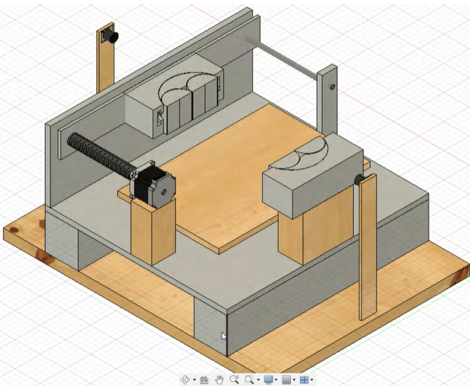
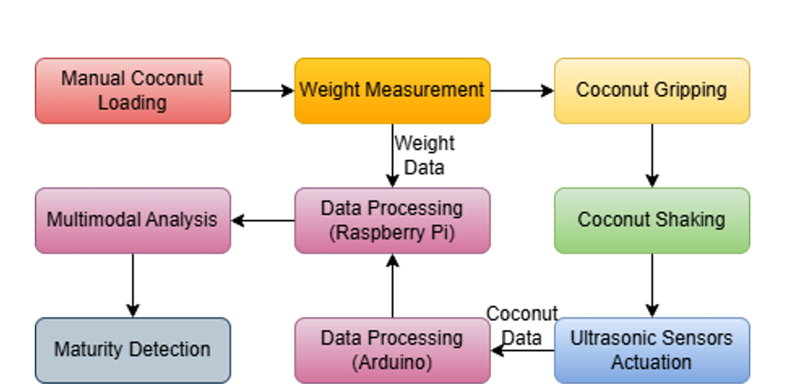
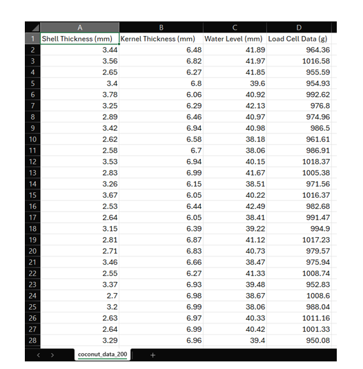
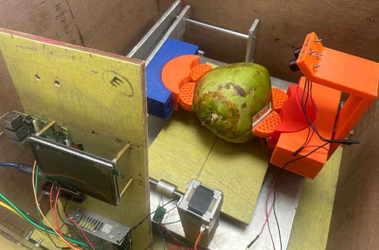
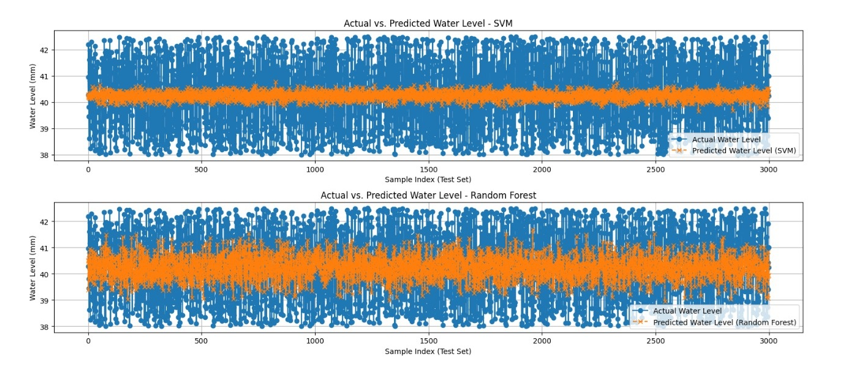

# Ultrasonic-Spectroscopy-for-non-invasive-Raw-Coconut-Detection

> A non-invasive, intelligent coconut quality inspection system using ultrasonic spectroscopy, oscillatory motion, and machine learning.

CocoSense is a second-generation coconut maturity detection prototype that uses ultrasonic wave analysis and internal fluid motion to evaluate the internal quality of coconuts. This system is designed for real-world scalability, accuracy, and non-destructive testing in post-harvest agricultural sorting.

---

## 📌 What It Does

- Uses **oscillatory motion** to trigger internal liquid movement
- Captures ultrasonic echo responses to assess water content
- Includes **load cell** and **force sensor** for weight + grip pressure
- Runs real-time classification using an **SVM model** on Raspberry Pi
- Outputs coconut condition: `Mature`, `Immature`, or `Spoiled`

---

## ⚙️ Step-by-Step Working

1. Coconut is placed in a **Fractal Vise** for uniform, secure gripping.
2. A **Force Sensor (FSR)** detects grip pressure to avoid over-squeezing.
3. A **Load Cell** measures the coconut’s weight as an input feature.
4. **Stepper Motor** oscillates the base to stimulate internal fluid.
5. **Ultrasonic Sensors** capture wave echo data from the coconut shell.
6. **Arduino UNO** gathers sensor data and forwards it to **Raspberry Pi 4**.
7. A trained **Support Vector Machine (SVM)** model processes the data.
8. The result is displayed or logged for maturity grading.

---

## 🔧 Hardware Components

| Component            | Purpose                                           |
|----------------------|---------------------------------------------------|
| Arduino UNO          | Sensor integration and signal preprocessing       |
| Raspberry Pi 4       | Running the ML model and decision-making logic    |
| Ultrasonic Sensors   | Echo detection of internal coconut water          |
| Load Cell            | Measure total coconut weight                      |
| Force Sensor (FSR)   | Ensure secure but safe coconut gripping           |
| Stepper Motor        | Provides oscillatory motion                       |
| Fractal Vise         | Gripping mechanism for stable sensor alignment    |
| SMPS Power Supply    | Power regulation for the system                   |

---

## 🧠 Machine Learning Overview

- **Model Used**: Support Vector Machine (SVM)
- **Other Tested Models**: Random Forest (RF)
- **Input Features**:
  - Ultrasonic echo timing & amplitude
  - Weight (load cell)
  - Pressure (FSR)
- **Classes**:
  - `Mature`
  - `Immature`
  - `Spoiled`

---

## 🧪 Test Results (Prototype Phase)

- ✅ Safe gripping with 0% coconut damage
- ✅ ±10% margin in predicting kernel-to-water ratio
- ✅ ~40% accuracy using early SVM model
- ✅ Echo noise reduced with foam padding
- ✅ Functional end-to-end prototype tested with real samples

---

## 🖼️ Figures

### 📐 Figure 1: Autodesk Fusion 360 Model  

### 🔁 Figure 2: Hardware Working Block Diagram  

### 📊 Figure 3: Sample Recorded Coconut Data  

### 🧪 Figure 4: Physical Hardware Setup  

### ✅ Figure 5: Sample Maturity Detection Result  

---

## 🧰 Tools Used

- **Fusion 360** – CAD for prototype design
- **Arduino IDE** – Microcontroller code
- **Python + scikit-learn** – ML model
- **Raspberry Pi OS** – ML runtime
- **Excel/CSV** – Data collection and preprocessing

---

## 🚀 Future Scope

- Add **robotic claw + conveyor** for batch coconut sorting
- Build a **touchscreen HMI** for human interface
- Add **real-time IoT dashboard** for tracking farm output
- Improve dataset with labeled images + waveform plots
- Develop a **Digital Twin** using MATLAB & sensor fusion

---

## 🙌 Credits

Developed by **Vedant Mate** and team  
This is a hardware + AI integration project for agri-automation research

---

## 📄 License

Open for educational and non-commercial use only.  
For use in research or further development, please attribute the authors.

---
